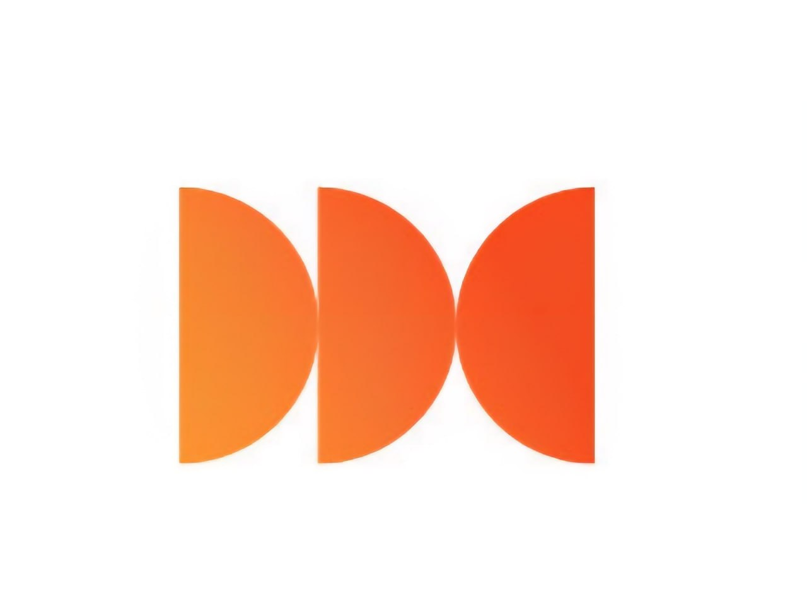

# Обучение работе в AMOCRM

Полный курс для администраторов и кураторов клиники

Работа со
сделками

Работа с
задачами

Работа с
воронками

Работа с
пациентами

Автоматические
сообщения

Источники
трафика

Контроль
качества

KPI и
дисциплина

1. Знакомство с
AMOCRM2Воронки и
этапы работы

3. Карточка
сделки и задачи

4. Автоматизация
и источники трафика

Навигация

# Структура обучения: 4 блока

01. Знакомство с amoCRMВход, интерфейс, рабочий стол, разделы

02. Воронки и этапы

Первичка, вторичка, Call Center, упущенные

03. Карточка сделки и задачи

Поля, комментарии, задачи, закрытия, чек-лист смены

04. Автоматизация, трафик и аналитика

Боты, WhatsApp, теги, источники, маркетинг

DEMOkrat dental clinic · amoCRM training02/74
Цель курса

# Главный результат обучения

Пациент не должен теряться ни на одном этапе

- каждая заявка обработана в первые 5–15 минут;
- у каждой сделки есть актуальная задача;
- каждый разговор зафиксирован понятным комментарием;
- этап сделки отражает реальную ситуацию пациента;
- источник трафика заполнен корректно;
- в конце смены нет просрочек, сделок без задач и расхождений.
DEMOkrat dental clinic · amoCRM training03/74

# БЛОК 1. Знакомство с amoCRM

Разбираем вход в систему, главные разделы, рабочий стол, задачи, контакты, аналитику и ежедневный контроль.

DEMOkrat dental clinic · amoCRM training04/74

# Что такое amoCRM

amoCRM — облачная CRM-система для работы с пациентами, заявками, звонками, задачами и аналитикой.

- единая база пациентов;
- история всех коммуникаций;
- контроль звонков и задач;
- ведение пациентов по воронкам;
- автоматические сообщения пациентам;

- контроль администраторов и кураторов;
- отчетность по заявкам и записям;
- аналитика рекламы;
- системная работа с упущенными пациентами;
- снижение хаоса в операционной работе.
DEMOkrat dental clinic · amoCRM training05/74

# Как войти в систему

1. Получить ссылку для доступа от руководителя.
2. Открыть ссылку в браузере: Chrome, Яндекс, Edge, Opera.
3. Ввести логин.
4. Ввести пароль.
5. Нажать «Войти».

Система облачная: вход возможен с любого компьютера через браузер.DEMOkrat dental clinic · amoCRM training06/74

# Основные разделы amoCRM

Рабочий стол

Контроль показателей

Сделки

Работа с пациентами

Задачи

Основной рабочий раздел

Списки

Контакты пациентов

Аналитика

Звонки и отчеты

DEMOkrat dental clinic · amoCRM training07/74

# Рабочий стол: что контролируем

- сделки без задач;
- просроченные задачи;
- лиды за день;
- закрытые сделки;
- воронка первичных пациентов;
- воронка вторичных пациентов;

- диаграмма звонков за сегодня;
- количество звонков по пользователям;
- качество обработки заявок;
- общая дисциплина работы сотрудников.
Ежедневно сотрудники отправляют скриншот рабочего стола руководителю.DEMOkrat dental clinic · amoCRM training08/74

# Раздел «Сделки»

В разделе «Сделки» ведется основная работа с пациентами.

- каждая сделка — это отдельная история пациента;
- сделки распределены по воронкам;
- воронки показывают путь пациента;
- этап сделки должен соответствовать реальной ситуации;
- по сделке обязательно должна стоять задача.
DEMOkrat dental clinic · amoCRM training09/74

# Раздел «Задачи»

Это основной рабочий раздел администратора.

- просроченные задачи;
- задачи на сегодня;
- задачи на завтра;
- задачи на неделю;
- задачи на будущее;
- быстрый переход в карточку сделки.

В конце смены просроченных задач быть не должно.DEMOkrat dental clinic · amoCRM training10/74

# Раздел «Списки»

- хранятся все контакты пациентов;
- можно искать пациента по имени или телефону;
- можно проверить, есть ли контакт в базе;
- можно перейти в карточку контакта;
- видно общее количество контактов.

Перед созданием новой сделки полезно проверить, нет ли уже такого пациента в базе.DEMOkrat dental clinic · amoCRM training11/74

# Раздел «Аналитика»

Основная вкладка для работы — «Звонки».

- входящие звонки;
- исходящие звонки;
- пропущенные звонки;
- недозвоны;

- прослушивание звонков;
- скачивание записей;
- контроль активности сотрудников;
- проверка качества коммуникации.
DEMOkrat dental clinic · amoCRM training12/74

# БЛОК 2. Воронки и этапы

Разбираем, где должна находиться каждая сделка, как переносить пациентов и какие правила действуют в каждой воронке.

DEMOkrat dental clinic · amoCRM training13/74

# 4 воронки в amoCRM

Первичные пациенты

Новые обращения и первичные записи

Вторичные пациенты

Пациенты после визита в клинику

Call CenterХолодная база и отдельные обзвоны

Упущенные клиенты

Отказы, возражения и возврат пациентов

DEMOkrat dental clinic · amoCRM training14/74

# Воронка «Первичные пациенты»

Воронка для всех новых обращений: звонки, сайт, реклама, карты, соцсети, рекомендации.

1. Необработанная заявка
2. Не дозвонились / Не берут трубку
3. Дозвонились, думают о записи
4. Записались на услугу
5. Не пришли
6. Пришли
7. Закрыто и нереализовано
DEMOkrat dental clinic · amoCRM training15/74

# Этап «Необработанная заявка»

Берем в работу за 5–15 минут

- новая сделка создается автоматически;
- заявки не должны задерживаться в этом этапе;
- чем быстрее обработка, тем выше шанс записи;
- если есть сделки в этом этапе — их нужно срочно обработать.
DEMOkrat dental clinic · amoCRM training16/74

# Этап «Не дозвонились / Не берут трубку»

Сюда переводим пациентов, с которыми не удалось связаться.

- пациент не берет трубку;
- линия занята или недоступна;
- пациент систематически не отвечает;
- после перевода запускается автоматическое сообщение, если бот настроен.

Работа ведется по регламенту «Механика 3/3».DEMOkrat dental clinic · amoCRM training17/74

# Регламент «Механика 3/3»

| Срок | Действие | Задача |
| --- | --- | --- |
| 1 день | 3 звонка → перевод в «Не дозвонились» + авторассылка | Дозвониться |
| 2 день | 3 звонка + персональное сообщение вручную | Дозвониться |
| 3 день | 3 звонка | Дозвониться |
| Через неделю | 3 звонка + рассылка | Дозвониться |
| Еще через 2 недели | 3 звонка + рассылка | Дозвониться |
| Через месяц | 3 звонка + рассылка | Можно закрывать |

Общее время работы с заявкой при постоянном недозвоне — примерно 1,5 месяца.DEMOkrat dental clinic · amoCRM training18/74

# Исключения по недозвонам

- автоответчик закрываем после 3 звонков и сообщения;
- брак номера закрываем сразу;
- спам закрываем сразу;
- каждый недозвон фиксируем через задачу и комментарий.

Нельзя закрывать обычную заявку только потому, что пациент не ответил 1–2 раза.DEMOkrat dental clinic · amoCRM training19/74

# Этап «Дозвонились, думают о записи»

Сюда попадают пациенты, которые ответили, но пока не записались.

- думают;
- сравнивают клиники;
- не готовы принять решение;
- перенесли запись;
- отменили запись, но остаются на связи.

- обязательно фиксируем возражение;
- договариваемся о следующем контакте;
- ставим задачу;
- пишем понятный комментарий;
- не оставляем сделку без движения.
DEMOkrat dental clinic · amoCRM training20/74

# График контактов для «Думают»

| Контакт | Когда | Что сделать |
| --- | --- | --- |
| 1 | Сразу после поступления сделки | Первичный звонок/сообщение |
| 2 | Через 3–4 дня | Возврат к решению |
| 3 | Через 1 неделю после 2-го | Повторная коммуникация |
| 4 | Через 3 недели после 3-го | Контроль интереса |
| 5 | Через 1 месяц после 4-го | Финальный контакт / контроль |
| 6 | По договоренности | Контрольная задача |

В конце каждого разговора обязательно договариваемся о следующей дате контакта.DEMOkrat dental clinic · amoCRM training21/74

# Этап «Записались на услугу»

Сюда переводим пациента только при подтвержденной дате и времени визита.

- заполнить дату и время приема;
- выбрать врача;
- указать источник трафика;
- заполнить обязательные поля;
- поставить задачу «Подтверждение записи» или «Напомнить о визите»;
- зафиксировать договоренности в комментарии.
DEMOkrat dental clinic · amoCRM training22/74

# Регламент подтверждения записи

| Когда | Действие |
| --- | --- |
| Сразу после записи | Уходит SMS/WhatsApp с напоминанием о записи |
| За сутки | Прозвон на подтверждение |
| 10:00–12:00 | Первая волна: всем, до кого не дозвонились, пишем сообщение |
| 15:00–16:00 | Вторая волна: звоним тем, кто не ответил на сообщение |
| В день приема | Если ответа нет — звоним за несколько часов заранее |

DEMOkrat dental clinic · amoCRM training23/74

# Этап «Не пришли»

- пациент записался, но не пришел;
- не предупредил или предупредил менее чем за 15 минут;
- после 2 таких неприходов сделку можно закрывать по правилу;
- если пациент на связи и готов перезаписаться — переводим в «Дозвонились, думают».

Для непришедших отправляется автоматическое сообщение с предложением перезаписаться.DEMOkrat dental clinic · amoCRM training24/74

# Этап «Пришли»

Сюда переводятся все пациенты, которые посетили клинику.

- не важно, была только консультация или начато лечение;
- после перевода amoCRM автоматически создает сделку во вторичной воронке;
- дальнейшая работа ведется уже как со вторичным пациентом.
DEMOkrat dental clinic · amoCRM training25/74

# Этап «Закрыто и нереализовано» в первичке

- здесь остается только «мусор»: спам, брак номера, дубль;
- остальные причины должны переводить пациента в упущенную базу;
- количество причин закрытия нужно сокращать и стандартизировать;
- любое закрытие требует корректного комментария и причины.
DEMOkrat dental clinic · amoCRM training26/74

# Контроль первичной воронки

У каждой клиники своя норма. Средние ориентиры:

| Этап | Средний ориентир |
| --- | --- |
| Необработанная заявка | 0 сделок |
| Не дозвонились | до 120 сделок |
| Дозвонились, думают | до 300 сделок |
| Записались на услугу | около 50 сделок |
| Не пришли | 50–80 сделок |

DEMOkrat dental clinic · amoCRM training27/74

# Воронка «Вторичные пациенты»

Воронка для пациентов, которые уже были в клинике.

- Были в клинике — этап рождения вторички;
- Лечатся с куратором — план лечения купили / продолжают лечение;
- Пришли, но не купили — план составлен, пациент ушел думать;
- Лечатся, оплата по факту — лечение без куратора;
- Профосмотр — нужен контроль через 6 месяцев или год;
- Закрыто и нереализовано — клиника отказалась или пациент не из города / переехал.
DEMOkrat dental clinic · amoCRM training28/74

# Этап «Были в клинике»

- сюда автоматически попадает вторичная сделка после этапа «Пришли» в первичке;
- пациент был в клинике один раз;
- дальше нужно определить следующий шаг;
- обязательно ставим задачу на контакт или следующий визит.
DEMOkrat dental clinic · amoCRM training29/74

# Этап «Пришли, но не купили»

План лечения составлен, но пациент пока не продолжил лечение.

- первое сообщение сразу после визита;
- первый звонок через 3–4 дня;
- второй звонок через неделю после первого;
- третий звонок через месяц после второго;
- при недозвоне обязательно пишем персональное сообщение.
DEMOkrat dental clinic · amoCRM training30/74

# Работа с пациентами «Лечатся с куратором»

- после каждого приема ставим задачу «Контроль» или «Куда дальше»;
- не упускаем прогресс пациента;
- после сложных процедур ставим задачу на следующий день — узнать о самочувствии;
- если пациент записан на несколько приемов, сообщение о записи расписываем сразу по всем приемам.
DEMOkrat dental clinic · amoCRM training31/74

# Работа с «Профосмотром»

### Через 6 месяцев

- пациент стабильно делает гигиену;
- часто проверяет состояние зубов;
- часто лечится;
- нужен регулярный контроль.

### Через 1 год

- для всех остальных пациентов;
- после завершенного лечения;
- если регулярность посещений ниже.
DEMOkrat dental clinic · amoCRM training32/74

# Воронка Call Center

- используется для холодной базы;
- подходит для новых клиник или специальных обзвонов;
- если заявок в воронке нет — работать в ней не нужно;
- источник трафика у таких сделок обычно «Холодная база».
DEMOkrat dental clinic · amoCRM training33/74

# Воронка «Упущенные клиенты»

Сюда попадают пациенты, по которым еще можно отработать возражение.

- слишком дорого;
- есть свой доктор;
- не устроили условия;
- отложили решение;
- ушли думать и не вернулись.

Из 10 упущенных пациентов можно вернуть 2.DEMOkrat dental clinic · amoCRM training34/74

# БЛОК 3. Карточка сделки и задачи

Разбираем заполнение карточки, постановку задач, комментарии, правила закрытия, дубли и чек-лист смены.

DEMOkrat dental clinic · amoCRM training35/74

# Карточка сделки

Карточка сделки — основной рабочий инструмент.

- ФИО и контакты пациента;
- ответственный;
- оператор;
- источник трафика;
- дата и время приема;
- врач;

- история звонков и сообщений;
- задачи;
- примечания;
- важные комментарии;
- этап воронки;
- автоматические поля рекламы.
DEMOkrat dental clinic · amoCRM training36/74

# Ответственный по сделке

- ответственный ставится автоматически;
- если по первичке стоит руководитель — меняем на администратора;
- идеально: в первичной воронке ответственным по сделкам является администратор;
- задачи ставятся на того, кто должен выполнить действие.
DEMOkrat dental clinic · amoCRM training37/74

# Поле «Бюджет»

Поле системное, удалить его нельзя, но в работе клиники оно не ведется.

- amoCRM не считает суммы лечения автоматически;
- каждый новый визит пришлось бы складывать вручную;
- поэтому поле «Бюджет» пропускаем;
- финансовые данные ведутся в других системах/таблицах.
DEMOkrat dental clinic · amoCRM training38/74

# Автоматические рекламные поля

- UTM-метки и рекламные поля заполняются автоматически;
- вручную их заполнять не нужно;
- у пациента не нужно спрашивать данные для этих полей;
- если появились рекламные поля — уточните у руководителя, какая реклама запущена.

Администратор должен понимать инфоповод, по которому пациент оставил заявку.DEMOkrat dental clinic · amoCRM training39/74

# Обязательные поля карточки

| Поле | Как заполнять |
| --- | --- |
| Оператор | Кто прозвонил / взаимодействовал с пациентом |
| Куратор | Заполняется, когда пациент пришел и понятно, кто его ведет |
| Источник трафика | Как пациент узнал о клинике |
| Дата и время приема | Выбирается из календаря / корректируется вручную |
| ФИО врача | Выбирается из списка |
| Возрастная группа | По дате рождения пациента |
| План лечения составлен | Только после визита, не заранее |

DEMOkrat dental clinic · amoCRM training40/74

# Если поле не заполнено

amoCRM не даст сохранить перевод сделки

- обязательные поля подсветятся красным;
- система покажет, что нужно дозаполнить;
- перед переводом сделки проверяем карточку;
- лучше заполнить данные сразу после разговора.
DEMOkrat dental clinic · amoCRM training41/74

# Комментарии к сделкам: обязательное правило

Комментарии пишутся по всем сделкам.

1. Чем интересуется пациент?
2. Какая ситуация?
3. Какое возражение / почему не записался?
4. На чем договорились?
5. Какой следующий шаг уходит в задачу?

Все важные комментарии должны быть зафиксированы. Важное примечание можно закрепить в карточке.DEMOkrat dental clinic · amoCRM training42/74

# Пример хорошего комментария

Пациент интересуется имплантацией. Был на консультации в другой клинике. Сомневается из-за стоимости. Рассматривает рассрочку. Договорились созвониться в пятницу после 15:00. Поставлена задача «Связаться».

- понятно, что хочет пациент;
- понятно, почему не записался;
- понятно, что делать дальше;
- следующий контакт зафиксирован задачей.
DEMOkrat dental clinic · amoCRM training43/74

# Главное правило задач

У каждой сделки должна быть задача

- сделка без задачи = риск потери пациента;
- задача должна иметь дату, время и тип;
- задача должна быть понятна другому сотруднику;
- после выполнения обязательно фиксируем результат.
DEMOkrat dental clinic · amoCRM training44/74

# Типы задач

| Тип | Когда использовать |
| --- | --- |
| Связаться | Нет точной договоренности / передача информации / рассылки |
| Дозвониться | Пациент не выходит на связь |
| Срочно | Нельзя переносить, договоренность именно на этот день |
| Профосмотр | Звонок или сообщение на профосмотр |
| Профгигиена | Приглашение на гигиену |
| Уточнить у доктора | Нужно получить информацию от врача |
| Звонок заботы | Самочувствие / забота после процедуры |
| Подтверждение записи | Подтверждение визита |
| Собрать ОС | Обратная связь после лечения |

DEMOkrat dental clinic · amoCRM training45/74

# Как поставить задачу

1. В карточке сделки выбрать «Задача».
2. Указать дату.
3. Указать время или оставить на весь день, если точного времени нет.
4. Проверить ответственного.
5. Выбрать тип задачи.
6. Написать краткий понятный комментарий.
7. Сохранить задачу.

Если договорились о конкретном времени звонка — ставим конкретный интервал, а не задачу на весь день.DEMOkrat dental clinic · amoCRM training46/74

# Как выполнить задачу

1. Открыть задачу.
2. Позвонить / написать пациенту.
3. Зафиксировать результат.
4. Нажать «Выполнить».
5. При необходимости поставить следующую задачу.

Пример результата: «Подтвердила визит на 31.10 в 11:00».DEMOkrat dental clinic · amoCRM training47/74

# Срочные задачи: сроки

| Ситуация | Максимальный срок без веской причины |
| --- | --- |
| Срочная терапия / хирургия | 1–2 дня |
| Протезирование / имплантация | 3–4 дня |

В конце каждого звонка стараемся утвердительно договориться о следующей дате контакта.DEMOkrat dental clinic · amoCRM training48/74

# Правила закрытия лидов

Самостоятельно закрывать лиды можно только по причинам:

Спам

Брак номера

Дубль

По всем остальным причинам заявки закрываются только через управленца / куратора.DEMOkrat dental clinic · amoCRM training49/74

# Процесс закрытия через куратора

1. Выбирается 1 день в неделю, например пятница.
2. Администратор ставит подробный комментарий, почему заявку нужно закрыть.
3. Администратор ставит задачу «Закрыть» на куратора именно на пятницу.
4. Куратор выделяет 1–2 часа на разбор задач.
5. Если лид закрывается — закрываем по всем правилам.
DEMOkrat dental clinic · amoCRM training50/74

# Правила закрытия дублей

- указать правильную причину закрытия;
- добавить комментарий с ФИО пациента;
- вставить ссылку на действующую сделку;
- в действующей сделке вставить ссылку на дубль;
- если номера разные — добавить второй номер в действующую сделку.
DEMOkrat dental clinic · amoCRM training51/74

# Чек-лист закрытия смены

Нет сделок без задач

Нет просроченных задач

Все сделки обработаны

Нет расхождений между amoCRM, Айдентом и таблицей

Все закрытые сделки закрыты по правилу

Разговор на линии стремится к 1,5 часам в день, для клиник от 6 кресел — к 2 часам

DEMOkrat dental clinic · amoCRM training52/74

# Сверка расхождений

- в конце каждой смены сверяем amoCRM и таблицы;
- проверяем расхождения между amoCRM, Айдентом и таблицей;
- если обнаружены ошибки — исправляем до конца смены;
- не переносим хаос на следующий день.
DEMOkrat dental clinic · amoCRM training53/74

# Использование ИИ для отчета после приема

Для качественной передачи информации после приема можно надиктовывать отчет и обучать ИИ структурировать его.

- психотип пациента;
- с чем пришел;
- какой настрой;
- заинтересован или нет;
- какие вопросы задавал;
- какие возражения были;
- особенности и договоренности;
- следующие зафиксированные шаги.
DEMOkrat dental clinic · amoCRM training54/74

# Работа с листом ожидания

- ведется через amoCRM и типы задач;
- дополнительно может вестись через Айдент;
- помогает быстро закрывать окна в расписании;
- помогает перезаписывать пациентов;
- увеличивает загрузку клиники.
DEMOkrat dental clinic · amoCRM training55/74

# БЛОК 4. Автоматизация, источники трафика и аналитика

Разбираем автоматические сообщения, ботов, WhatsApp, теги, источники трафика, маркетинг и контроль аналитики.

DEMOkrat dental clinic · amoCRM training56/74

# Автоматические сообщения

amoCRM может автоматически отправлять пациентам сообщения в WhatsApp.

- после новой заявки;
- если не удалось дозвониться;
- после записи на прием;
- с информацией о враче;
- если пациент не пришел;
- после визита — сбор обратной связи.

Сообщения копировать вручную не нужно, если бот настроен.DEMOkrat dental clinic · amoCRM training57/74

# Сообщение после новой заявки

- благодарность за обращение;
- название клиники;
- адрес;
- номер телефона;
- сайт.

Цель: пациент понимает, кто ему будет звонить и с какого номера.DEMOkrat dental clinic · amoCRM training58/74

# Сообщение при недозвоне

- клиника сообщает, что не смогла дозвониться;
- предлагает написать удобное время для связи;
- дает номер телефона клиники;
- пациент может ответить в WhatsApp;
- сообщение подтягивается в карточку сделки.
DEMOkrat dental clinic · amoCRM training59/74

# Сообщение после записи

- дата приема;
- время приема;
- ФИО врача;
- адрес клиники;
- просьба взять паспорт;
- просьба подойти заранее.

- ссылка на маршрут в Яндекс Картах;
- ссылки на отзывы;
- фото врача;
- описание врача;
- напоминание предупредить при изменениях.
DEMOkrat dental clinic · amoCRM training60/74

# Сообщение «Не пришли»

- сообщаем, что пациент не пришел;
- предлагаем перезаписаться;
- просим написать удобное время или перезвонить;
- не создаем ощущения «черного списка»;
- возвращаем пациента в коммуникацию.
DEMOkrat dental clinic · amoCRM training61/74

# Сбор обратной связи

- после визита отправляется NPS-опрос;
- ответы попадают в таблицу клиники;
- опрос помогает контролировать сервис;
- можно дорабатывать ботов и шаблоны под клинику.
DEMOkrat dental clinic · amoCRM training62/74

# Источники трафика: зачем заполнять точно

Аналитика должна сходиться

- руководство оценивает эффективность рекламы;
- маркетинг принимает решения на основе источников;
- ошибка администратора искажает отчетность;
- окупаемость рекламы зависит от корректной атрибуции заявок.
DEMOkrat dental clinic · amoCRM training63/74

# Основные источники трафика

- Яндекс Карты;
- Google Поиск;
- Google Карты;
- Сайт;
- Яндекс Контекст;
- VK таргет;
- Группа ВКонтакте;

- Instagram аккаунт;
- Рекомендации;
- Пришли с улицы;
- Звонок;
- Повторный клиент;
- Холодная база;
- Про

Докторов.
DEMOkrat dental clinic · amoCRM training64/74

# Как работать с тегами

Теги помогают понять, откуда пришла заявка и по какому инфоповоду.

- заявка с сайта → источник «Сайт»;
- Яндекс Карты → источник «Яндекс Карты»;
- ВКонтакте → платная реклама VK;
- Про

Докторов → портал Про

Докторов;
- импланты, коронки, лендинг → инфоповоды рекламной кампании.

Если тег есть, а источника нет — попросите руководителя добавить корректный источник трафика.DEMOkrat dental clinic · amoCRM training65/74

# Когда amoCRM не может определить источник

- если пациент звонит на прямой номер клиники;
- если нет подменных номеров на площадках;
- если обращение пришло не через интегрированный канал;
- если тег «Посетители без рекламной кампании».

В этих случаях обязательно спрашиваем: «Как вы о нас узнали?»DEMOkrat dental clinic · amoCRM training66/74

# Маркетинговый контекст: бюджет рекламы

| Период | Ориентир бюджета |
| --- | --- |
| 1 месяц | 250 000–350 000 ₽ в зависимости от модели запуска |
| 2 месяц | 350 000 ₽: контекст + таргет |
| Далее | 100 000 ₽ на каждое кресло |
| Минимальное пополнение | 60 000 ₽ |
| Пополнение | не менее чем за 10 дней до окончания средств |

DEMOkrat dental clinic · amoCRM training67/74

# Почему рекламу нельзя ставить на паузу

- окупаемость оценивается только через 6–8 месяцев;
- пользователи редко записываются с первого касания;
- обычно нужно 3–5 контактов;
- алгоритмы рекламных платформ обучаются со временем;
- пауза обнуляет прогрев аудитории и сбивает обучение алгоритмов.

Стоимость лида не является единственным и главным показателем эффективности.DEMOkrat dental clinic · amoCRM training68/74

# Почему администратор влияет на окупаемость рекламы

- корректно указывает источник трафика;
- быстро обрабатывает заявки;
- фиксирует возражения;
- ставит задачи и не теряет пациента;
- доводит заявку до записи;
- не закрывает лид без регламента.

Маркетинг приводит заявку. CRM и администратор превращают ее в пациента.DEMOkrat dental clinic · amoCRM training69/74

# Контроль показателей

### Каждый день

- рабочий стол;
- просроченные задачи;
- сделки без задач;
- необработанные заявки;
- звонки.

### Раз в неделю / месяц

- конверсия по этапам;
- количество сделок в воронках;
- статистика рекламы;
- качество комментариев;
- дисциплина закрытий.
DEMOkrat dental clinic · amoCRM training70/74

# Ежедневный контроль руководителя / куратора

- каждый день — разбор на 5-минутках с администраторами;
- раз в неделю — отчет по статистике;
- разбор просрочек и сделок без задач;
- контроль качества комментариев;
- контроль корректности источников трафика.
DEMOkrat dental clinic · amoCRM training71/74

# Финальные правила работы в amoCRM

01
Заявки обрабатываем за 5–15 минут02
У каждой сделки есть задача03
Все важное фиксируем комментарием04
Этап = реальная ситуация пациента05
Источник трафика заполнен корректно06
В конце смены нет просрочек

DEMOkrat dental clinic · amoCRM training72/74

# Практическое задание после обучения

1. Создать тестовую сделку.
2. Заполнить карточку сделки.
3. Указать источник трафика.
4. Перевести сделку по этапам.
5. Поставить задачу.
6. Выполнить задачу с результатом.
7. Оставить примечание.
8. Проверить сделку в разделе задач.
DEMOkrat dental clinic · amoCRM training73/74

# Спасибо за внимание

Успешной работы в amoCRM!

DEMOkrat dental clinicDEMOkrat dental clinic · amoCRM training74/74
